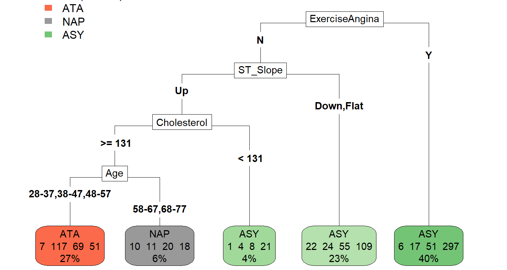

# Heart-Disease-and-Chest-Pain-Prediction

This is a final project carried out by Owen Patrick, Cam Lunn, and myself. In this project, my group had a goal of predicting both chest pain type and heart disease within patients. We performed the following:
* Exploratory data analysis (EDA) on the data set to prune necessary features with the strongest prediction power
* Linear Discriminant Analysis (LDA) to predict both chest pain type and heart disease
* Quadratic Discriminant Analysis (QDA) to predict chest pain type and heart disease
* K-Nearest Neighbors to predict chest pain type and heart disease.
* Decision Trees to predict chest pain type and heart disease

Feel free to check out the full code in the RMD or the full report in the attached PDF! Here is a brief summary of our findings as the PDF and RMD are pretty lengthy documents:

# LDA

First, LDA was performed based on heart disease status and chest pain type. As shown in 
the first graph below, the data is fairly well separated by the first linear discriminant based 
on those affected or unaffected by heart disease. As shown in the second graph below, the 
four types of chest pain are not very well separated by LD1 and LD2.

LDA for chest pain type

LDA for heart disease (affected vs unaffected)

# QDA
* When predicting heart disease, QDA performed fairly well, achieving an accuracy score of about 76.8%.
* When predicting chest pain type, QDA was not as effective as predicting heart disease, as it achieved an accuracy score of 61.44%. As shown in the confusion matrix, the most commonly misclassified chest pain types were NAP (52.615% balanced accuracy) and TA (49.828% balanced accuracy).

# KNN

* When predicting heart disease, QDA performed fairly well, achieving an accuracy score of about 76.8%.
* When predicting chest pain type, the choices for k were looped through to find the ideal choice when carrying out the algorithm. K = 16 was determined to be the best choice as it yielded the highest accuracy rate. The KNN algorithm performed fairly poorly when predicting chest pain status with an accuracy score of 62.31%

# Decision Trees

Decision Tree for chest pain type

The output of the pruned tree is shown above. This tree returned an accuracy score of 61.44%. Excercise angina was the first factor considered in the tree with those affected classified as having ASY chest pain. For those with no exercise angina, people with an ST slope of Down or flat were classified as having ASY chest pain as well. Next, those with cholesterol under 131 were also classified as having ASY chest pain. People with cholesterol over or equal to 131 were than either classified as having ATA chest pain (in ages 28 to 57) or NAP chest pain (in age groups 58 to 77)

Decision Tree for heart disease (affected vs unaffected)

The output of the pruned tree is shown above This tree returned an accuracy score of 88.45%. ST_Slope was the first predictor variable considered. After this the tree considers all other predictor variables in its decisions besides age which is an interesting takeaway. This means that age on its own is not a very useful variable for predicting if someone has heart disease, according to this model. With about 88% accuracy this is by far our best model for predicting heart disease.

# Summary of Findings
Our goal was to use patient health data to predict whether someone has heart disease as well as what kind of chest pain they are likely to have. With cardiovascular illness related deaths so prevalent in the United States, it is vital that work is done to catch heart disease and chest pain in patients before it is too late. This project provides useful insight into what the most significant indicators of heart disease and chest pain are and simultaneously allows us to see what preventative measures can be taken to reduce risk of heart disease. We had success in meeting our research objectives, most notably in predicting heart disease status. Our best model was the decision tree which had an accuracy of about 88.45% in predicting heart disease status. This means that given data of a new patient in the same format as used in the model, we have around an 88.45% chance of correctly predicting whether or not they have heart disease. We did not have much success with predicting chest pain type and only achieved an accuracy of around 62% with our best model. KNN was marginally better than our decision tree with an accuracy of 62.31% versus 61.44%. Because this difference is so small and decision trees are more easily interpretable, we concluded that the decision tree is the best method for predicting chest pain type. Overall, the decision tree method proved to be the most accurate and interpretable out of all three methods we attempted using.

Data source: https://www.kaggle.com/datasets/johnsmith88/heart-disease-dataset
